# **Milestone Project 4**
**Full Stack Frameworks with Django Milestone Project Milestone Project.**

**Tadig Restaurant**

[View the live project here.](tadig-restaurant)
This website is made for restaurants. We named our restaurant "Tadig restaurant" which is a made-up Persian restaurant.
It is designed to be responsive and accessible on a range of devices, making it easy to navigate for potential customers.


## **Contents** ##
* UX
    * [Project Summary](#project-summary)
    * [User Stories](#user-stories)
    * [Design Choices](#design-choices)
* [Wireframes](#wireframes)
* [Features](#features)

* [Technologies](#technologies)
* [Testing](#testing)
* [Fixed Issues](#fixed-issues)
* [Deployment](#deployment)
* [Credit](#credits)

## **UX (User Experience)** ##

### **Project Summary** ###

The main purpose of this project is to build a full-stack site based around business logic used to control a centrally-owned dataset.
By authenticating on the site and paying for some of its services, users can advance their own goals. Before authenticating, the site makes it clear how those goals would be furthered by the site.
The site owner is able to make money by providing this set of services to the users. There is no way for a regular user to bypass the site's mechanisms and derive all of the value available to paid users without paying.

### **User Stories**

#### **As a Site Users**

- **Registeration and User Account**
  - I want to be able to easily register for an account, so that I can have a personal account and be able to view my profile.
  - I want to be able to easily login and logout, so that I can have access my personal account information.
  - I want to be able to easily recover my password in case I forget it, so that I can recover access to my account.
  - I want to be able to receive an email confirmation after registering, so that I can verify that my account registeration was successful.
  - I want to be able to have a personalized user profile, so that I can view my personal order history and order confirmations and save my payment information.
  - I want to be able to see each product review, so that I can easily choose the meal(product), based on the comments and reviews.
  - I want to be able to add a review, so that I can share my thoughts with other customers and the owners of the restaurant.

#### **As a Shopper**

- **Viewing and Navigating**
  - I want to be able to view a list of products, so that I can select some to purchase.
  - I want to be able to view individual product details, so that I can identify the price, description, product rating and product image.
  - I want to be able to easily view the total of my purchases at any time, so that I can avoid spending too much.

- **Sorting and Searching**
  - I want to be able to sort the list of availabe products, so that I can easily identify the best rated, best priced and categorically sorted products.
  - I want to be able to sort a specific category of product, so that I can find the best priced product in a specific category, or sort the products in each category.
  - I want to be able to sort multiple categories of products simultaneously, so that I can find the best priced products.
  - I want to be able to search for a product by name, category or description, so that I can find a specific product I'd like to purchase.
  - I want to be able to easily see what I've searched for and the number of results, so that I can quickly decide wheather the product I want is availabe.

- **Purchasing and Checkout**
  - I want to be able to easily select the quantity of a product when purchasing it, so that I can ensure I don't accidentally select the wrong product or quantity.
  - I want to be able to view items in my bag to be purchased, so that I can identify the total cost of my purchase and all items I will receive.
  - I want to be able to adjust the quantity of individual items in my bag, so that I can easily make changes to my purchase before checkout.
  - I want to be able to easily enter my paiment information, so that I can check out quickly and with no hassles.
  - I want to be able to feel my personal and payment information is safe and secure, so that I can confindently provide the needed information to make a purchase.
  - I want to be able to view an order confirmation after checkout, so that I can verify that I haven't made any mistakes.
  - I want to be able to receive an email confirmation after checking out, so that I can keep the confirmation of what I've purchased for my records.

#### **As a Store Owner**

- **Admin and Store Managment**
  - I want to be able to add a product, so that I can add new items to my store.
  - I want to be able to edit or update a product, so that I can change product pricees, descriptins, image or other product criteria.
  - I want to be able to delete a product, so that I can remove items that are no longer available.

### **Design choices**

  The goal in design was to create a website that is overall user friendly, has a modern feel with emphasis on providing information about the restaurant dishes/drinks in a readable and eye-catching way. Therefore, following design choices were made:
- **Framework**
  * Front-end framework, [Bootstrap](https://Bootstrap.com/),  based on bootstrap Design was chosen for this project for its modern interface and ease of use.

  * [JQuery](https://jquery.com/) was used for initializing some bootstrap elements.

- **Typography**
  - I used [Google Fonts](https://fonts.googleapis.com/css?family=Lato&display=swap") for the font style of my project:
    - The font I have used for this project is called **Lato** and sans-serif as a backup font.

- **Icons**
  - I used [Favicon](https://flask.palletsprojects.com/en/1.1.x/patterns/favicon/) to make a unic brand for my website.
  - I used [FontAwesome]() as the main icon library across the project (e.g. for forms and buttons).

- **Colour Scheme**

  The idea of using different shades of the same colour is implemented accross the website. The primary colour used for main buttons and headings is deep purple as it seems to create a nice contrast with white backgrounds. The secondary colour used for icons, dividers and some other buttons is blue and pink.

  - **Main colour palette**

    - Main colors that have been used are black and white and some shades of gray due to their high contrast which complement the colorful images.
    - For toast messeges headers and some labels I used bootstrap scheme:
        - Succsess: #28a745; which is a shade of green color.
        - Danger: #dc3545 ; which is a shade of red color.
        - Primary: #007bff ; which is a shade of blue color.
        - secondary: #6c757d ; which is a shade of gray color.
        - warning: ##ffc107 ; which is a shade of yellow color.
        - info: #17a2b8 ; which is a shade of blue color.
        - light: #f8f9fa ; which is a shade of light gray color.
        - dark: #343a40 ; which is a shade of dark gray color.
---
## **Wireframes**
[Balsamiq Wireframes](https://balsamiq.com/wireframes/) was used to create all wireframes for the project.

 #### <center>Home Page<center>

Desktop view | Mobile view
- | -
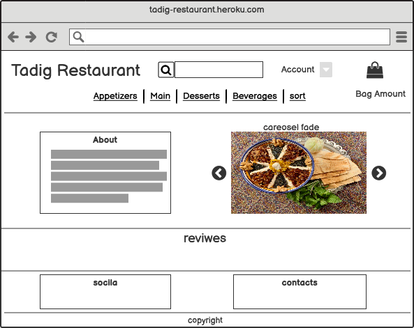 | 
---

 #### <center>Product details page<center>

Desktop view | Mobile view
- | -
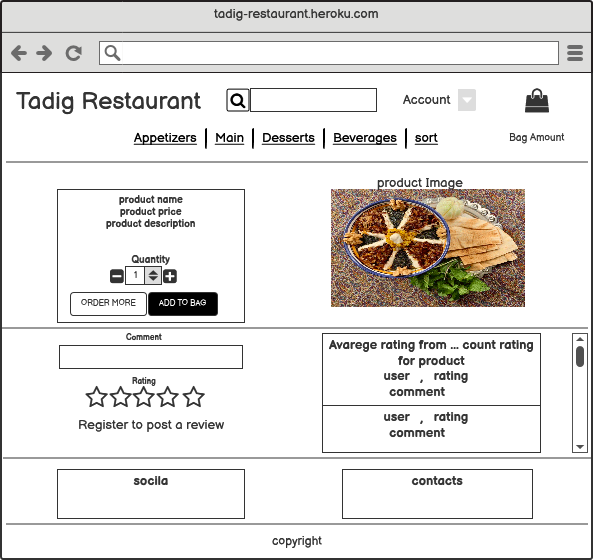 | 
---

 #### <center>Products page<center>
 Desktop view | Mobile view
- | -
 |  
---
 #### <center>Shopping bag page<center>
 Desktop view | Mobile view
- | -
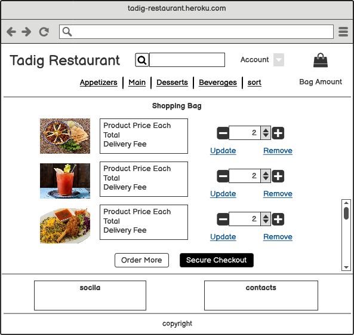 | 
---

 #### <center>Checkout page<center>
Desktop view | Mobile view
- | -
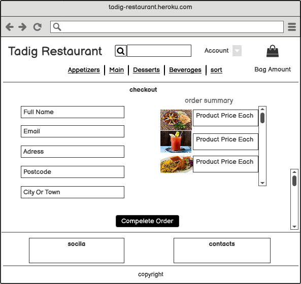 | 
---

 #### <center>Checkout success page<center>
 Desktop view | Mobile view
- | -
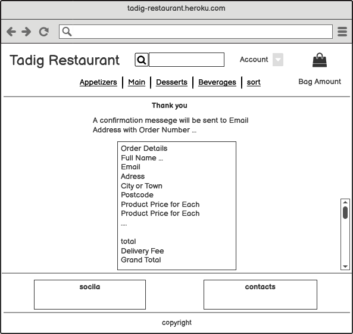 | 
---

 #### <center>Profile page<center>
 Desktop view | Mobile view
- | -
 | 

 #### <center>Log In<center>
 Desktop view | Mobile view
- | -
 | 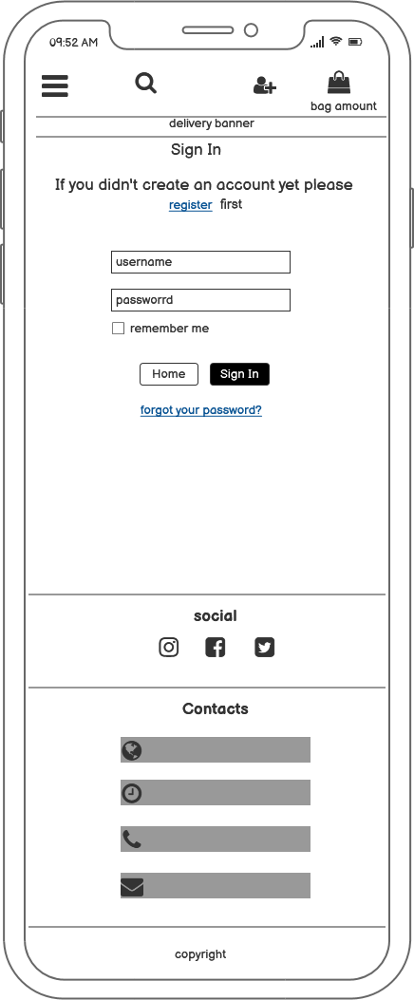
---

 #### <center>Register<center>
Desktop view | Mobile view
- | -
 | 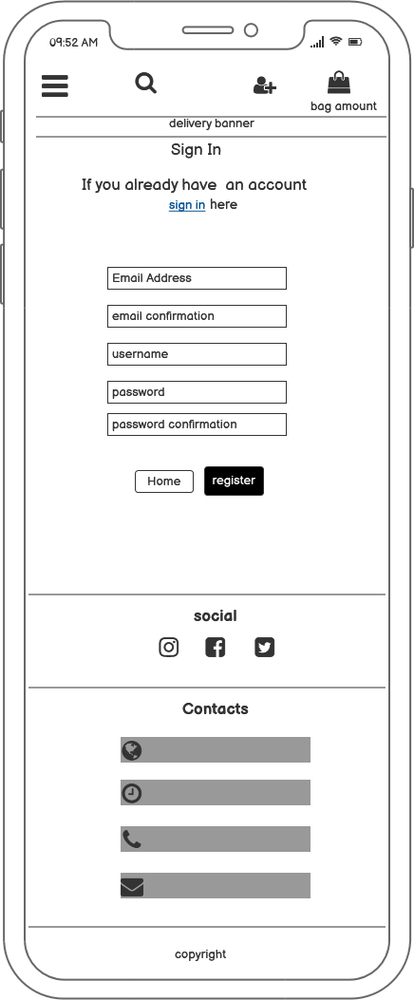
---

 #### <center>Log OUt <center>
Desktop view | Mobile view
- | -
 | 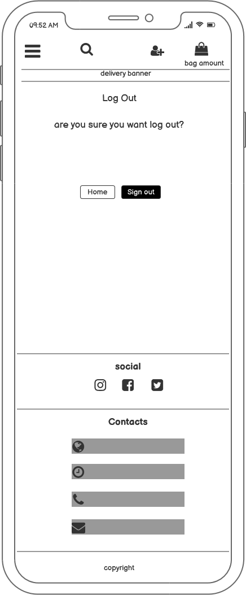
---

 #### <center>Add product oage ( Only Admin)<center>
Desktop view | Mobile view
- | -
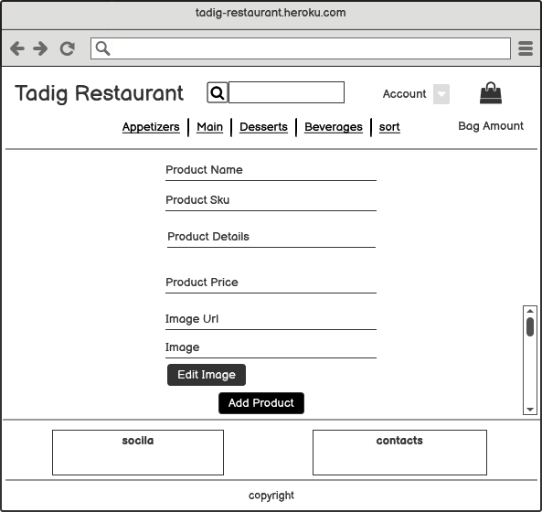 | 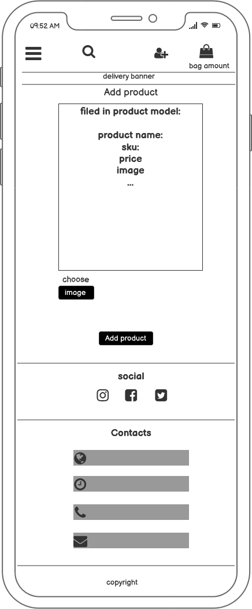
---

## **Features**
- **Implemented features**
  - **Common features in all pages**
    - All of the pages contain a 3 part layout with the header, main part of the page and the footer.
        - **Header**
            - **main navbar**
                - Main navbar is deviding the products that are provided in to diffrent categories of: appetizers, main dishes, desserts and beverages and a sorting dropdown button.
                on medium and large screens, main navbar is fixed on top of the page and is lined up in a line. In smaller screens this navbar turns to a dropdown navbar.
                - Another item in this navbar is "Sort" which sorts all the products by their name, price or category.
            - **Home button**
               - On medium and large screens restaurant logo works as the home button but in smaller screen home button is added to the dropdown navbar.
            - **Search, Account and Bag**

                In all views,the search area, account and bag are fixed on top of the page.

                **Search**

                - Customers can search for the name, category or any word from a product description to easily find them, 
                - By clicking on the search icon, the search result and the number of the search result will be shown under the search area.
                - If the filed is empty when search icon is clicked a toast message appear on top right corner of the page and notifies the user.

                **Account**

                - Account is a dropdown button which contains the *register* and *logout* for all the users.
                - **Log in button** is added to this list for registered users.
                - Admin or super user access an extra button from here which is called *Manage Products*, which is used to add new products to the list of products.

                **Bag**

                - This shows a grand total amount of the products added to the shopping bag and placed on the top right corner.

                **Delivery Banner**
                - This part will notify the user that by shopping more than 200 kr, which is the free delivery treshold, they would earn the free delivery.

        - **Footer**

            Footer is devided to 3 parts. *Social* , *Contacts* and *Copyright*, which is locted at the bottom of the pages.
            **Social** contains the facebook, twitter and instagram.
            **Contacts** contains the address, phone number, opening time and email address of the restaurant.
            these parts are positioned under each other in small views and in medium and larger views contacts and social are positioned side by side and copyright is positioned under them.
---
  - **Home Page**

    - The home page contains the eyecatching carousel slide with the colorful images that makes the perpose of the website clear from the begining.
    - Breaf information about the restaurant in provided to the left side of the carousel in medium and larg screens and in smaller screens, this information is placed ontop of the carousel.
    - Carousel is showing all the product images. By clicking on each image user is directed to product details page, which showes that product, all the information related to it, and can add it to the back right away.
    - Under the about note and carousel, all the reviews that have been added for any product is displayed with their name, avarege rating and number of rates.
---
  - **Products Pages**

    - By clicking on the main navbar categories in the top header, users are directed to respective category page, which has the name, image, price, number of reviews and avarege rating information of all producs in that category.
    - Under the price of each product is also a form that user can use to add any product in this category to their shoping bag.
    - When user adds a product to their shoping bag they will be notified by a toast message on top on the page, which shows that product information.
    - If the price of the items are lower than free delivery treshold, it will show in this toast message that how much more they should add to their bag to get the free delivery.
    - User is informed with the header on top of the page that by clicking on product images they get more information about that product.
    - when clicking on product image user is redirected to the product details page which has the description of that product.
    - Sorting only in each specific category is also possible by the sorting dropdown input provided on top of this page, which can sort the products based on their price, rating or name.
    - There is also a scroll back to top button is provided in this page, to easily go back to the top of the page.
    - On medium and larger views the product info and image are positioned side by side but on smaller views they are placed under each other.
    - Admin or super user provided with extra links under eah product price to either delete or edit that product.
---
  - **Product Details Page**

    - This page shows the product name, price, avarege rating,image and description.
    - A form to add this product to the shopping bag is located under the product price.
    - By choosing the amount, and then clicking on Add to Bag, user will see a toast messege on top of the page that shows the product information in their bag.
    - If the grand total of the products value is lower than the delivery treshold, user will be notified the amount that they should spend more in order to get free delivery in the toast messege.
    - The toast message also provide the user with a button to be redirected to thier shopping bag.
    - under the product details and image there is a reviews form for the product with a comment and rating inputs and submit button.
    - All the reviews for this product is shown including the name of the user, rating and their respective comments.
    - on small screens the product information, shopping and quantity bottons review form and reviews are placed under each other, but in medium and larger views they are placed side by side.
    - Admin or super user provided with extra links under the product price to either delete or edit this product.
---
  - **Shopping Bag Page**

    - user can easily reach this page by clicking on the bag icon on top right corner of all pages or on the notification toast that they will see on top of the products and products details, after clicking on the add to bag button.
    - If user has any pruduct in their shopping bag, they can review them in this page.
    - User can easily update the amount or remove the products in their bag, in this page.
    - The amount on Total shopping, delivery fee and grand total is shown under this page with two buttons.
    - One button is to redirect the user to products page, to order something more, and the other redirects the user to checkout page.
    - If there isn't any product in the shoping list, user will be notified that the bag is empty and get the option to be redirected to products page.
    - In small views the Grand total and secure checkout botton is placed on top of the page and the chosen products and their details placed under the buttons.
    - In larger views the products information is placed on top of the billing information and the checkout botton.
---
  - **Checkout Page**

    - By clicking on the secure checkout button on the shopping bag page, user will be redirected to checkout page.
    - In this page user can see the summary of their order, and a form to fill the information required for the delivery.
    - by filling this form and clicking on the *Compelete Order* button, user can securely purchase from the site with the help of stripe elements.
    - On x-small screens order summary is placed on top of the order form and under the form there is the *Compelete Order* button and *Adjust Bag*.
    - Product images is not seenable in the x-small views to improve the page layout.
    - On small and larger screens the order summary and form placed side by side and the compelete order and adjust bag buttons are at the bottom of the page.
---
  - **Checkout Success Page**

    - After compeleting the order form and click on the compelete order botton, in checkout page, user will see a nice overlay for a short time untill the proccess of shoping compelets.
    - User then will be redirected to checkout success page and see a toast message on top of the page, notifing the user that the order is prossessed, the order number.
    - User also recives a confirmation email to their email address.
    - In this page all the order information is shown to the user, including the order number and date, purchased products and the price for each product, delivery information and the total amount of the purchase.
---
  - **Profile Page**

    - Profile user is only accessable for registered users.
    - If a non registered user try to go to profile page by writing it in the browser he/she will be redirected to the sign in page.
    - Registered user have an access to their profile in account dropdown button, in the header.
    - In profile page, there is a information form that can be filled.
    - The first time that the user compelete an order these information will be filled automaticlly.
    - User can update these information in profile page, with filling the form and click on update information botton.
    - After filling this form, these information will set to the checkout form when user want to order any products.
    - In this page, user can see all the previous orders list, in a table, and can review each on of them.
    - Clicking on each order in the table redirects the user to checkout success page.
    - On entering the checkout Success page from the profile, user gets a toast messege that this is a past confirmation for that order number.
    - under the form there is a button that redirects the user back to their profile page.
---
  -**Shopping bag page**

    - Displays selected products to be purchased and its details 
    - Users can add and reduce product quantity from the shpping bag and the cost will adjust accordingly 
    - Users can remove selected products from the shipping bag and cost will adjust accordingly
    - Proceed to checkout page

  - **Checkout App**

    - If a user is authenticated and has a profile the delivery/shipping form will be pre-populated with their default info else if the user is not authenticated the form will be empty 
    - A summary of the products & cost the user is about to purchase will be avaible on display next to the delivery/shipping form
    - Stripe secure card validation: the card entered by the user will be validated in real time by stripe and if valid:
    - the purchase will go through and the user will be automatically redirected to success page showing order confirmation details
    - Upon successful purchase: confirmation email is sent to the user, containing their order summary

  - **Manage Product Page and Admin features**

    - Admin or super user has access to an extra button in account dropdown menu.
    - by clicking it, the add product form opens, and a new product can be added to the products.
    - Super user also can edit or delete each product with clicking on the edit or delete links provided under the price of each product in the products and product details page.

  - **Register**

    - On registeration user is asked to enter their email address, email confirmation , fullname, username and a password and password confirmation.
    - If a user tries to register an email which is used by someone else already, they will not be allowed to use that username. The user will be notified of this - "A user is already registered with this e-mail address.".
    - If a user tries to register an username which is used by someone else already, they will not be allowed to use that username. The user will be notified of this - "A user with that username already exists.".
    - If a user password and confirm password dosen't match user gets a toast message - "Passwords do not match, please re-enter"
    - User is not allowed to use a common, all numeric, under 8 charecter or too similar to the user name for seurity reseons.
    - If user already has an account the can click on the sign in link on the line on top of this page to sign in.
    - there is a home button under the page that redirects the user to home page if they don't want to make an account.
    - When a user has successfully registered their new account, they will be redirected to home page.
---
  - **Login page**

    - There is a link on top of this page that redirects the user to sign up page if they don't have an account yet.
    - User needs to fill in the username and password to login.
    - There is a checkbox with *Remember Me* label. clicking this checkbox will same the username and password for next login.
    - If a registered user puts their infomation in incorrectly when loging in, they will be notified by a messages - "The username and/or password you specified are not correct.".
    - If a user attempts to login several time unsuccfully, they will be notified by a message - "Too many failed login attempts. Try again later."
    - there is a home button under the page that redirects the user to home page if they don't want to login.
    - When a user has successfully logged in, they will be redirected to home page with a success notification toast messege.

  - **Log Out**
    - user is provided by the option to log out when clicking on the button provided on the account dropdown button in the top navbar.
    - By clicking on "Log Out" button user get a message to check if they really want to log out.
    - On log out user redirects to log in page and getting a flash message: "You have been logged out!"
---
- **Features Left to Implement**
   - adding more responsive design for my image fields.
   - Adding sort products based on the avarege rating.
   - Adding the like/dislike function in a new section in profile page.
   - Adding social media sites for the app.
   - Adding food delivery time system for the app.
   - Additional payment methods like paypal or applepay
   - Fix the rating template form.
   - better confirmation note for delete product.
---
## **Technologies**
- **Front-End**

    - HTML5 was used to put the page structure in place [HTML5](https://validator.w3.org/).
    - CSS was used to style and allign images and other structures on the page [CSS](https://www.w3.org/Style/CSS/Overview.en.html).
    - Javascript was used for interactivity [JavaScript](https://www.ecma-international.org/).
    - Bootstrap was used for page layout [Bootstrap](https://getbootstrap.com/).
    - Google fonts was used for the site fonts [Google fonts](https://fonts.google.com/).
    - Fontawesome was used for its icons [Font awesome](https://fontawesome.com/).

- **Back-end**

    - Python3 was used for the application scripting [Python](https://www.python.org/).
    - Django framework was used to build the Project [Django](https://www.djangoproject.com/).
    - Amazon web service was used to host static and media files [AWS](https://aws.amazon.com/).
    - Postgres database was used for the deployed app on heroku [Postgres](https://www.postgresql.org/).
    - Gunicorn server was used for the deployed app on heroku [Gunicorn](https://gunicorn.org/).
    - Stripe payment service was used for product payments [Stripe](https://stripe.com/).

- **Deployment**

    - Heroku for hosting the application [Heroku](https://dashboard.heroku.com/apps).
    - I used gitpod's development environment to write the code for this project [Gitpod](https://www.gitpod.io/).
    - I used github for its repo and version control of the project [Github](https://github.com/).
    - I used google smtp email to send emails to users [google](https://support.google.com/mail/answer/7126229?hl=en).
    - I used Chrome DevTools for ressponssive design.

- **validators**
  - The validators that have been used on the project are as followed:
    - [HTML Validator](https://validator.w3.org/nu/) - 2 warnning due to Meta and head element not found
        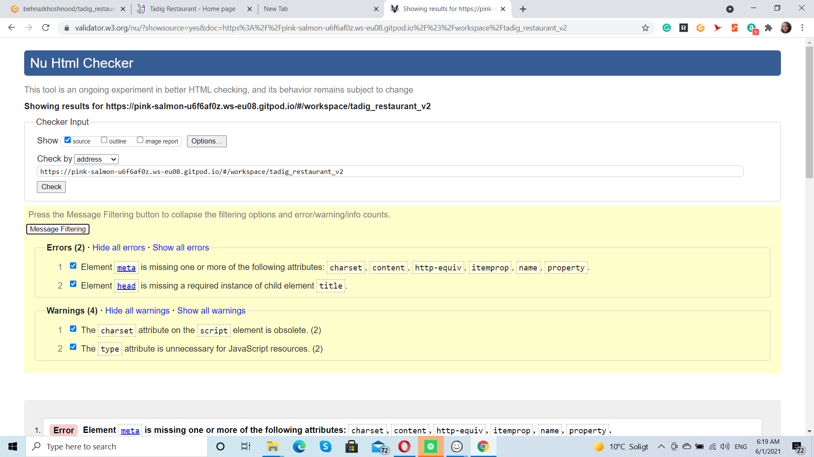
    - [CSS Validator](https://jigsaw.w3.org/css-validator/) - No issues
    - [JavaScript Validator](https://jshint.com/) - No issues 
    - [Python Validator](http://pep8online.com/) - No issues

- **User stories tests**
- ****Testing user experience:****

  - **Product Owner**
    - can easily add a product via product form
    - can easily edit/update product info
    - can easily delete products
  - **Sign-up / Login**
    - user: can successfully sign up for an account by filling the the required form fields and will recieve a confirmation email
    - user : users also have an easy option of socisl login, by providing their google account
    - user: users can successfully recover their passwords by clicking on the forgot password: which will send an email to the provided email adddress with the necessary link for password recovery.
  - **Logged in / authenticated users**
    - user: Logged in users can save their default delivery/billing info on their profile page
    - user: logged in users can successfully add items to their wishlist for later purchase
    - user: logged in users can review products that they have bought
  - **authenticated and unauthenticated users**
    - user: can successfully browser the site by gender, category or price and make a selection to buy
    - user: can successfully view each product details to identify price, read other users reviews on the product,select a product size or quantity
    - user : can quickly use the search icon to search for products they are intrested in
    - user : can easily access products on sale and keep track of their total shopping bag cost throughout the site i. shopping bag:
    - user: can easily access their shopping bag items, which conveniently contains all their selected products, which can be added,subtracted or removed from the shopping bag and the cost recalculates accordingly.
    - Easy and secure stripe checkout process with no hassle.
    - user: upon successful checkout: user gets redirected to success page with order details and a confirmation email is also sent to the user with their order details.
---
## **Testing**
- **Supported browsers and screens**

  - The Website was tested on Google Chrome, Microsoft Edge, and Firefox and Opera browser.

  - The website was shown responsive on a variety of emulated devices such as iphone4, 5, SE, 6, 6 plus, 7, 7plus, 8, 8plus and X, Nokia Lumia 520 and N9, Moto G4, Galaxy S5, Blackberry Z30 and playbook, Galaxy note, Microsoft Lumia 950 and 550, LG Optimus L70, Nexus 4, 5, 6, 7 and 10, 6P, Pixel 2 and 2XL, iPad mini, iPad, Kindle Fire, iPad pro and laptop with MDPI, touch, and HiDPI.

  - A large amount of testing was done to ensure that all pages were linking correctly.

  - Friends and family members were asked to review the site and documentation to point out any bugs and/or user experience issues.
---
## **Fixed Issues**

- **Issue 1** 
  - By clicking on the stars in that rating inputs, form was jumping on top of the page.
    I fixed this problem by changing the code below:

        .rating:not(:checked) > input { 
            position:absolute; 
            top:-9999px;
            clip:rect(0,0,0,0); 
        }

    to

        .rating:not(:checked) > input { 
        display: none; 
        }


- **Issue 2**
  - when rendering the divisibilityby in products pages the last div with <hr> was showing even if there wasn't any other product in the list.
    I fixed this issue by adding this code in css:

        .divisibleby:last-child{
            display: none;

- **Issue 3** 
  - Some of the Images when blurry.
  - I fixed this issue by using this code to my img css:

        image-rendering: -webkit-optimize-contrast;

- **Issue 4**
  - I had some migration issues that have been fixed by deleting all migrations in all apps exept the __int__ and migrate them again.

- **Issue 5** 
  - Bag was showing the delivery fee even when nothing in shoping bag.
  - I fixed this issue adding this code:

        if (
            self.order_total < settings.FREE_DELIVERY_THRESHOLD and
            self.order_total != 0):
            self.delivery_cost = settings.STANDARD_DELIVERY_FEE
        else:
            self.delivery_cost = 0

- ** Known Issues **
  - the social icons for twiter and istagram is not shown in my index page!
  - the review rating form stoped working and just adds one star to my products after deleting the migrations.
  - stripe payment-intent-success gives error 500
  - in some views the toast notifications are blurry

---
## Deployment

### Steps to deploy Tadig to Heroku using Postgres

#### In Heroku:
1. Setup and account and log in to Heroku
2. On the apps page select `NEW`.
3. Give the app a name and select the closest region – then click `Create App`.
4. Click on Resources tab to provision a new Postgres database for it.
5. Search in the Addons search bar for `Heroku Postgres`.
6. Select your Development plan (in my case - Hobby Dev Plan).

#### In GitPod or IDE:
7. To use postgres open project in GitPod and install:
```
*   pip3 install dj_database_url
*   pip3 install psycopg2-binary
*   Update requirements: pip3 freeze > requirements.txt
```

#### In Django - setup new database:
In `Settings.py`:   

8. Make sure import os is there.
9. Add: `import dj_database_url`.
10. Goto Database settings and comment out existing database setting and add below example to point the database at the new Postgres database.
```
example:
    DATABASES = {
        'default': dj_database_url.parse( # ***paste in the database URL from Heroku***)
    }
```
11. Run Migrations. `Migrations have now been made to the Postgres Database.`
12. After a Successful Migration goto memberships.models.

---
***Important:***

13. Comment out the `post_save_create_memberships` signal - ***this is because creating a user will trigger this signal to create a free membership. 
But as there will be no packages setup within our new database - we must stop this signal before we create our superuser.***   
---
14. Now we can create a superuser -: `python3 manage.py createsuperuser`.
15. Runserver and login as superuser to the admin page.
16. Goto Packages in the memberships section.
17. Click add package to add each of the following 2 packages
*   package type: free.
*   package price: 0.
*   stripe plan id: (price_id) get this from your stripe - Products - Free Plan - Pricing - API id.   

***and***  
*   package type: premium.
*   package price: 5.
*   stripe plan id: (price_id) get this from your stripe - Products - Premium Plan - Pricing - API id.
18. Save and logout of admin.
19. Stop the server.
20. Uncomment the signal from step 13.
21. Restart the server and check admin - the superuser will now be linked to a free package type and have a stripe customer id.
22. Goto Settings -  Database settings - remove the Postgres database URL.
23.  Create an if/else code block to check if the os.environ variable is defined. 
if it is defined that will mean we are on Heroku so we will use the Postgres database.
Else we will be in our local environment and so use the default database.
```
    Example: 
    if 'DATABASE_URL' in os.environ:
        DATABASES = {
            'default': dj_database_url.parse(os.environ.get('DATABASE_URL'))
        }
    else:
        DATABASES = {
            'default': {
                'ENGINE': 'django.db.backends.sqlite3',
                'NAME': os.path.join(BASE_DIR, 'db.sqlite3'),
            }
        }
```

24. In the Terminal install gunicorn as our webserver: `pip3 install gunicorn`
25. Freeze requirements. `Pip3 freeze > requirements.txt`
26. Create a Procfile at the same level as the project. 
27. Enter the following code into the Procfile to tell Heroku to create a web dyno that will run gunicorn and serve tadig:
```
    web: gunicorn tadig-testaurant.wsgi:application
```
28. Temporarily disable collect static – to do this:
*   login via the terminal: heroku login –i.
*   Enter heroku email and password.
*   Enter the following in the terminal:
```
    heroku config:set DISABLE_COLLECTSTATIC=1 --app mr-smyth-tadig-restaurant
```
In `Settings.py`:   

29. Add the hostname of the Heroku app – to ALLOWED_HOSTS (also include localhost):
```
    ALLOWED_HOSTS = ['tadig-restaurant.herokuapp.com', 'localhost'].
```
30. Ensure all .env variables such as the Django and stripe secret keys remain private. Also, make sure they are set up inside Heroku's config vars.

In `The Terminal`:

31. Deploy to Heroku:
*   Add and push to GitHub
*   git add .
*   git commit –m “**your-message**”
*   git push
*   Now initialize heroku git remote (because we created our app on the website rather than with the CLI): 
*       heroku git:remote -a mr-smyth-tadig-restaurant
*   Then push to heroku : git push heroku master

In `The Heroku`:

32. Setup automatic deployment in Heroku:
*   Goto the deploy tab
*   Set deployment method to GitHub
*   Search for tadig-restaurant
*   Click connect
*   Scroll down and click Enable Automatic Deploys

tadig-restaurant is now deployed to Heroku

[<< ***Back to contents***](#table-of-contents)

## Local Deployment

**Before starting, some prerequisites:**

*   Before starting you should have an IDE set up - [Visual Studio Code](https://code.visualstudio.com/). - for example.
*   Its advisable to have a virtual environment setup. Pythons own can be used : 

```
    python3 -m .venv venv
    .venv\Scripts\activate
```

*   Have **at least** the following installed:   
    *   Python3 - to run the application.
    *   Pip - to install any requirements.
    *   GIT - required for version control.


The above example displays an env for a local purpose only.

5.  Install all requirements for the application by using this command:
```
    sudo -H pip3 -r requirements.txt
```
6.  In the IDE terminal, use the following command to start tadig-restaurant:
```
    python manage.py runserver
```

tadig-restaurant should now be running locally on localhost port 8000. (http://127.0.0.1:8000)

7.  After running Django initially, it will create the local database **db.SQLite3**.
8.  Make all migrations:
```
python3 manage.py makemigrations --dry-run
python3 manage.py makemigrations
python3 manage.py migrate --plan
python3 manage.py migrate
```

9.  Create a superuser:
```
python3 manage.py createsuperuser
***Enter username, email and password***
```

You should now have a local copy of tadig-restaurant.

---  

## **Credits**
- **Content and Media**

  The content and images used in this site were obtained from links below:

| Starter page | Main page | Desserst page | Drink page |
|:---------------|:---------------|:---------------|:---------------|
| [Kashke bademjan](https://persianfoodtours.com/wp-content/uploads/2019/10/Kashk-e-Bademjan.jpg) | [Baghali polo](https://www.behesht.co.ukimages/behesht/foods/maincourse/baghali-polo.jpg) | [Baklava](https://encrypted-tbn0.gstatic.comimages?q=tbn%3AANd9GcSyftLKhAJzlAmscp5fLjIjBYzrP-Vy1_7xsl9SHiQAFTu8vCeM&usqp=CAU) | [Doogh](https://www.thedeliciouscrescent.com/wp-content/uploads/2020/03/Doogh_5.jpg) |
| [Mirza ghasemi](https://claudiacanu.com/wp-content/uploads/2018/07/Mirza-Ghasemi-eggplant-sauce.jpg) | [Zereshk polo ba morgh](https://yummynotes.net/wp-content/uploads/2020/04/Zereshk-Polo.jpg) <br> Info : [Persian Mama](https://persianmama.com/zereshk-polo-ba-morgh/) | [Faloodeh shirazi](https://i.pinimg.com/originals/1b/d9/12/1bd9124c6ffb8cdfbc0e5e2c536dd2b1.jpg) | [Araghe bidmeshek](https://en.snapptrip.com/blog/wp-content/uploads/2017/05/Sharbat-e-Khakshi-1024x805.jpg) <br> Info : [Diba](https://dibaonline.de/NIK-Aragh-Bidmeshk-Willow-blossoms-430ml) |
| [Do piaze alo](https://3.bp.blogspot.com/-psIKWaAbLDc/Wt4mpNShYGI/AAAAAAAAKzM/Z4Rb5Bj-7Mka3VhIoJb6NAtpSwbJ0pQEgCLcBGAs/s1600/DoPiazeh_TurmericSaffron.JPG) | [Khoreshte gheyme bademjan](https://igotitfrommymaman.com/wp-content/uploads/2020/01/Khoreshe-Gheymeh-11-scaled.jpg) <br> Info : [Persian food tours](http://www.persianfoodtours.com/khoresht-gheymeh-bademjan-yellow-split-peas-stew/) | [Bastani sonnati](https://encrypted-tbn0.gstatic.comimages?q=tbn%3AANd9GcSgL85WQFb-72OdGFDShM4gpfIt5z1tGWhmIha_Tv8XBehXtcKE&usqp=CAU) | [Gol gav zaboon](https://images-na.ssl-images-amazon.comimages/I/61-KwamytGL._A.jpg) <br> Info : [The persian pot](http://www.thepersianpot.com/recipe/gol-gav-zaban-borage-tea/) |
| [Salad olvie](https://i.pinimg.com/originals/39/37/be/3937be2fea7c0c2fb2c9987b7a63bc4b.jpg) <br> Info : [Persian mama](https://persianmama.com/salad-olivieh-persian-chicken-salad/) | [Khoreshte ghorme Sabzi](https://www.196flavors.com/wp-content/uploads/2017/03/ghormeh-sabzi-3.jpg) | [Noon khamei](https://i1.wp.com/www.littleswissbaker.com/wp-content/uploads/2016/04/DSC_1897v2.jpg?w=680&ssl=1) | [Mojito](https://alldayidreamaboutfood.com/wp-content/uploads/2013/05/Honest-Mojitos-3.jpg) |
| [Noon panir sabzi](https://cdn.shortpixel.ai/spai/q_lossless+ret_img/https://3nkq72bhhp51kv1h2do55o5r-wpengine.netdna-ssl.com/wp-content/uploads/2.3_NAT_American-Herbal-Cookbook_NEW-Wordpress.jpg) <br> Info : [Clean plates](https://www.cleanplates.com/eat/recipes-eat/panir-sabzi/) | [Khoreshte fesenjoon ba morgh](https://3.bp.blogspot.com/-RaW9e0WBdAA/T_7DZs4o5sI/AAAAAAAACxs/xTdy-dEqpVQ/s1600/Fesenjoon-TS.jpg) | [Ranginak](https://4.bp.blogspot.com/-LBlaXdUqrYo/Tba1gvjYyHI/AAAAAAAACvs/l1bm02mG7-s/s1600/227458_206016996087508_100000376264948_606452_2793162_n.jpg) | [Berry juice](https://5.imimg.com/data5/LY/KU/OD/GLADMIN-7061725/berryjuice-500x500.jpg) |
| **More Drinks** |                                                                                                                                                                                                                                                                                  |
| [Watermelon juice](https://images.eatthismuch.com/site_media/img/854541_Shamarie84_45b61cdb-ddfc-43dd-bf1f-6c366caf07a5.png) | [Orange juice](https://www.earthfoodandfire.com/wp-content/uploads/2018/04/Homemade-Orange-Juice.jpg) | [Masala chai](https://wendypolisi.com/wp-content/uploads/2018/09/dirty-chai-latte-2.jpg) | [Bloody mary](https://www.bbcgoodfood.com/sites/default/files/user-collections/my-colelction-image/2015/12/bloody-mary.jpg) |
| [White russian](https://i.pinimg.com/originals/af/d2/4c/afd24c5047e6aaa1cfbe4dd8e8d7468f.jpg) |  [Espresso](https://kaffeexperterna.com/wp-content/uploads/2015/08/espresso-crema-kaffe.jpg) |

- **Resources**

  Below is a list of the resources used to create this project:

  - [Adding a favicon -- Flask documentations](https://flask.palletsprojects.com/en/1.1.x/patterns/favicon/)
  - [Stack Overflow](https://stackoverflow.com/)
  - [Slack Peer code review](https://slack.com/intl/en-se/)
  - [w3schools](https://www.w3schools.com/howto/tryit.asp?filename=tryhow_css_fixed_footer)
  - [To make responsive Footer](https://www.freecodecamp.org/news/how-to-keep-your-footer-where-it-belongs-59c6aa05c59c/)
  - [To fix my scrollbar style](https://www.w3schools.com/howto/howto_css_custom_scrollbar.asp)
  - [Dynamic carousel slider](https://stackoverflow.com/questions/30483186/bootstrap-carousel-and-django)
  - [Radio star input](https://gist.github.com/blairanderson/7f9d1c08345c6573e09edaa1f7316fa1)

### **Acknowledgements**

 - Big thanks to my mentor, Rohit Sharma who provided me with tips, support and some helpful resources.

 - Also the whole code instetute support team for fast support and help all the time.

**This project is purely educational, please contact me if there are any issues with Copyright.**